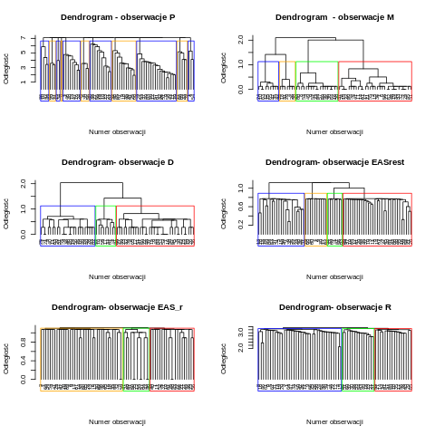

# Wstęp 

Niniejsza praca opisuje analizę unsupervised ramki "Po Osobach" w podziale na podzbiory. 

# Motywacja

Dane w naszej ramce są logicznie podzielone. Część kolumn dotyczy np. tylko odpowiedzi dzieci, inne dotyczą odpowiedzi dorosłych w ankiecie, inne znowu dotyczą danych demograficznych itd. Analiza pewnego zbioru ma odpowiedzieć nam na pytanie, jakie są zależności 
między kolumnami tych grup.

Zaproponowaliśmy uproszczoną analizę, która ma wykazywać związki między całymi grupami.

# Schemat testu

Test polega na:

- podzieleniu zbioru na podzbiory kolumn
- znalezieniu klas
- sprawdzeniu za pomocą testu $\chi^2$, czy dane klasy są ze sobą powiązane

# Podzbiory

Oto nasze podzbiory:

###Dataset P
* odpowiedzi na pytania skierowane do opiekunów, odnośnie ich oczekiwań co do wystawy i tego jak dziecko się zachowywało podczas zwiedzania.

###Dataset M
* dane dotyczące opiekuna, wiek, miejsce zamieszkania, wykształcenie, płeć.

###Dataset D
* dane dotyczące dziecka, wiek, płeć, relacja opiekun-dziecko

###Dataset EAS_r 
* charakterystyka cech temperamentu

###Dataset Eas_rest
* opisują emocjonalnosć , towarzyskość, aktywność, nieśmiałość dziecka

###Dataset R
* pytania skierowane do opiekuna odnośnie wrażeń po wystawie, o tym jak dziecko się zachowywało podczas zwiedzania, uwagi


# Znalezienie klas

Do klasteryzacji wykorzystaliśmy algorytm hclust2. Oto drzewa dla naszych podzbiorów:

```{r, echo=FALSE, out.width = "500px", out.height= "360px"}

```


Na podstawie tych drzew dokonaliśmy podziału zbioru. 

# Test $\chi^2$ w skrócie

Zakładamy, że nasze dwie zmienne kategoryczne są niezależne ($h_0$). Naszą hipotezą alternatywną jest to, że zmienne nie są niezależne ($h_1$). Przykładowo mamy:


|       | A | B | Total |
|-------|---|---|-------|
| 1     | 10 | 20 | 30    |
| 2     | 90 | 70 | 160   |
| Total | 100 | 90 | 190   |

Jeżeli zmienne są niezależne, to można ustalić na podstawie rozkładów brzegowych rokład ogólny.
Np. w A1 powinno być: 

$$\frac{30\cdot100}{190} \approx 15.789$$

To jest nasza wartość oczekiwana. 
Teraz dla każdej komórki obliczamy:

$$\frac{(observed - expected)^2}{expected}$$

a następnie sumujemy i ta suma jest naszą statystyką testową. $h_0$ zakłada, że statystyka ta ma dążyć do $0$.
Teraz po schemacie liczymy p-value etc. i odrzucamy hipotezę alternatywną, albo nie.

Będziemy znajdować takie pary etykiet, dla których statystyka jest duża, a p-value jest małe.

# Efekty testu $\chi^2$

```{r, echo=FALSE}
load("ChisqTestMatrix.rda")
library(lattice)
library(gridExtra)
Chisq_n <- Chisq
diag(Chisq_n) <- 0
p1 <- levelplot(Chisq_n)
p2 <- levelplot(Chisq_p)
grid.arrange(p1,p2,nrow=1)
```

Interpretacja:

Jak widać dla pewnych podzbiorów osiągamy dużą wartość statystyki dla małych p, mianowicie dla:

- R i P
- EASr i EASrest


**R i P**

Duże powiązanie zmiennych R i P jest oczywiste. Wynika to z tego, iż w pierwszym jak i w drugim zbiorze mamy do czynienia z odpowiedziami opiekunów na pytania związane z :

- ich oczekiwaniami odnośnie wystawy

- zachowaniem dzieci podczas zwiedzania

- wrażeniami po wystawie

Różnica między zbiorami :

- dla zbioru  P odpowedzi były zbierane przed i w trakcie wycieczki

- zbiór R był stworzony na podstawie pytań po zakoczeniu wizyty


**EASr i EASrest**

Oba datasety dotyczą charakterystyki cech temperamentu, tyle, że są przedstawione w nieco inny sposób. Zatem powiązanie między nimi jest naturalne.


