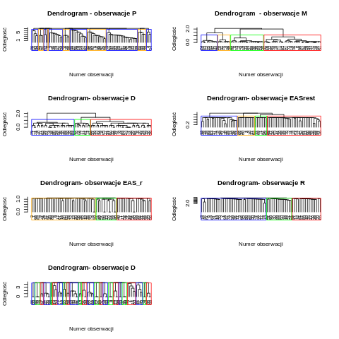

```{r setup, include=FALSE}
knitr::opts_chunk$set(echo = TRUE)
```

```{r, echo = FALSE, message=FALSE}
library(cluster)
library(clusterCrit)
attach(mtcars)
library(mlr)
library(factoextra)
library(FactoMineR)
library(dplyr)
library(readxl)
library(ggridges)
library(ggplot2)
library(DataExplorer)
library(tidyr)
library(mlr)
library(kableExtra)

osoby <- read_xlsx("bazy_danych/01B Po osobach - nowe.xlsx")
obserwacje <- read_xlsx("bazy_danych/01A Obserwacje_nowe.xlsx")

rm(list=ls())

dzieci<-read.csv(file="dzieci_olaf.csv")
data<-scale(dzieci)
```

# Wstęp

Niniejszy raport poświęcony jest opisowi procesu analizy "unsupervised" zbioru danych, dotyczącego zachowania dzieci odwiedzających Centrum nauki Kopernik. 

Zajmiemy się:

- analizą unsupervised całego zbioru

- analizą unsupervised podzbiorów i znalezieniu między nimi zależności

# Opis zbioru danych

Zbiór pochodzący z SWPS ma na celu opisać zachowania dzieci podczas zwiedzania Centrum nauki Kopernik. 
Zbiór składa się z dwóch ramek danych "po osobach" i "obserwacje". Jeden z nich dotyczy obserwacji jakie zarejestrowano w trakcie wizyty w CNK - Obserwacje_nowe.xlsx, kolejny dataset - Po_osobach.xlsx odnosi się do informacji jakie zebrano w ankietach przed i po zwiedzaniu, a także podsumowujące wrażenia odwiedziających.

## "Obserwacje"

W pierwszej kolejności omówimy zbiór danych zawarty w pliku Obserwacje_nowe. Są to pomiary wykonywane w interwałach czasowych ok. 20 min, mające na celu ustalić wrażenia i zachowanie zwiedzających w danych przedziałach czasowych.

- numer wydarzenia odpowiada za ID każdego wiersza

- każdy wiersz ma przypisany mu odowiadająco nr badanej pary (opiekun-dziecko) oraz nr badacza

- kategoria wydarzenia (1- eksponat, 2- pomiar nastroju i zmęczenia, 3- inne (przerwa, toaleta itp.))

- nr pomiaru interwału czasowegow trakcie pobytu w CNK

- pomiar zmęczenia i nastroju, oceniane w skali 1-9 oraz czas mierzenia nastroju

- ilość kroków rozpoczętych z lewej i prawej nogi w danym interwale czasowym

- galeria oraz eksponat na trasie zwiedzających

- w sali 0-1 mierzono zainteresowanie zwiedzjących wystawę (czyta, dotyka, używa itp)

- zapytano uczestników czy chcą kontunować zwiedzanie po zakończeniu programu, następnie ponownie rejestrowano ich zachowanie (podpunkt wyżej)

Pierwsze wiersze:
```{r, echo = FALSE}
obserwacje <- read_xlsx("bazy_danych/01A Obserwacje_nowe.xlsx")
kable(obserwacje %>% head) %>% 
  kable_styling() %>% 
  scroll_box(width = "800px", height = "400px")
```

Jak widać dane są sekwencyjne. W nieokreślonych interwałach rejestrowany był nastrój uczestników podczas ich wycieczki. Naszym zadaniem będzie odpowiednio zsumaryzować te dane.

Oto rozkłady naszych zmiennych:

- zmienne numeryczne:

```{r, echo = FALSE, warning=FALSE, message=FALSE}
g <- obserwacje %>% drop_columns(c('Inne zachowania',
                         'kategoria_wyd',
                         'poznawcze',
                         'D_woła',
                         'D_pyta',
                         'D_patrzy',
                         'R_czyta',
                         'R_tlumaczy',
                         'Uwagi',
                         'patrzy_ktos',
                         'R_dotyka',
                         'D_czyta',
                         'R_wola_D',
                         'Czy dalej',
                         'R_używa',
                         'animator2',
                         "czas_min_sec",
                         'Nastr_kiedy',
                         "interwal_dlugosc",
                        'Galeria',
                        'Nazwa eksponatu')) %>% gather() %>% drop_na()

ggplot(g, aes(x = value, y = key)) +
  geom_density_ridges() + 
  theme_minimal() +
  xlim(-100, 1000) +
  xlab("Wartość") +
  ylab("Cecha") +
  ggtitle("Rozkłady zmiennych numerycznych")

```

Zmienne kategoryczne:

```{r, echo = FALSE, warning=FALSE, message=FALSE}
g <- obserwacje %>% select(kategoria_wyd,
                         poznawcze,
                         D_woła,
                         D_pyta,
                         D_patrzy,
                         R_czyta,
                         R_tlumaczy,
                         patrzy_ktos,
                         R_dotyka,
                         D_czyta,
                         R_wola_D,
                         `Czy dalej`,
                         R_używa,
                         animator2) %>% gather() %>% drop_na()


ggplot(g, aes(x = value)) +
  facet_wrap(~key) +
  geom_bar() +
  theme_minimal() +
  xlab("Wartość") +
  ylab("Liczba") +
  ggtitle("Rozkłady zmiennych kategorycznych")
```

Pozostałe:

```{r, echo = FALSE, warning=FALSE, message=FALSE}
s <- summary(obserwacje %>% select(`Inne zachowania`, Uwagi, czas_min_sec, Nastr_kiedy, interwal_dlugosc, Galeria, `Nazwa eksponatu`))
s
```

## "Po osobach"

2.2 "Po osobach"
W kolejnym kroku opiszemy zawartość datasetu Po_osobach.

- za ID każdego rekordu odpowiada nr osoby badanej

- data pomiaru - rok 2016, styczeń

- seria pytań dotycząca nastawienia opiekuna do wizyty w CNK ( zainteresowanie, chęć zdobycia wiedzy, oczekiwania odnośnie dziecka i tego co z niej wyniesie) skala: 1- zdecydowanie się nie zgadzam, 7 - zdecydowanie się zgadzam

- pytania odnoszące się do zachowania dziecka na wystawie(grzeczne, ruchliwe, skoncentrowane itp), skala: 1- zdecydowanie się nie zgadzam, 7 - zdecydowanie się zgadzam

- uczucia jakie towrzyszyły w trakcie zwiedzania (radość, smutek, złość, zrelaksowanie, zdenerwowanie itd.) skala 1- b. rzadko, 4 - b.często

- dane zawierające informacje o płci, wieku opiekuna i dziecka oraz miejsce zamieszkania, wyksztalcenie opiekuna

- relacja opiekun- dziecko (np. rodzic)

- atrybuty EAS - kwestionariusz temperamentu dzieci, ocenianych przez opiekunów w kategoriach : emocjonalność, aktywność, towarzyskość, nieśmiałość

- zbiór pytań dotyczący wrażeń po wycieczce w CNK (chęć kontynowania zwiedzania, czy planują kolejne wizyty, poziom zadowolenia) skala 1- zdecydowanie tak,..., 5-zdecydowanie nie

- poziom zmęczenia fizycznego i psychicznego

- opinie opiekunów na temat przygtowania wystawy pod kątem dzieci, czy była wystarczająco zrozumiała, prosta w obsłudze, czy wybór eksponatów był odpowiedni itp. skala: zdecydowanie nie zgadzam się-1,..., 7-zdecydowanie zgadzam się

- pytania skierowane do dzieci, odnośnie ich wrażeń i zachowania podczas wystawy ( czy im się podobało, czy byli grzeczni, co nowego się dowiedzieli, czy chcieliby jeszcze odwiedzić CNK itd.)

- atrybuty odpowiadająca 6 typom oddziaływań rodzicielskich :akceptacji, odrzuceniu, autonomii, nadmiernego wymagania, niekonsekwencji, nadmiernego ochraniania


Kilka pierwszych wierszy:

```{r, echo=FALSE}
osoby <- read_xlsx("bazy_danych/01B Po osobach - nowe.xlsx")
kable(osoby %>% head) %>% 
  kable_styling() %>% 
  scroll_box(width = "800px", height = "400px")
```

# Analiza podzbiorów

W tej części opiszemy analizę unsupervised ramki "Po Osobach" w podziale na podzbiory. 

## Motywacja

Dane w naszej ramce są logicznie podzielone. Część kolumn dotyczy np. tylko odpowiedzi dzieci, inne dotyczą odpowiedzi dorosłych w ankiecie, inne znowu dotyczą danych demograficznych itd. Analiza pewnego zbioru ma odpowiedzieć nam na pytanie, jakie są zależności 
między kolumnami tych grup.

Zaproponowaliśmy uproszczoną analizę, która ma wykazywać związki między całymi grupami.

## Schemat testu

Test polega na:

- podzieleniu zbioru na podzbiory kolumn
- znalezieniu klas
- sprawdzeniu za pomocą testu $\chi^2$, czy dane klasy są ze sobą powiązane

## Podzbiory

Oto nasze podzbiory:

- Dataset P: odpowiedzi na pytania skierowane do opiekunów, odnośnie ich oczekiwań co do wystawy i tego jak dziecko się zachowywało podczas zwiedzania.

- Dataset M: dane dotyczące opiekuna, wiek, miejsce zamieszkania, wykształcenie, płeć.

- Dataset D: dane dotyczące dziecka, wiek, płeć, relacja opiekun-dziecko

- Dataset EAS_r: charakterystyka cech temperamentu

- Dataset Eas_rest: opisują emocjonalnosć , towarzyskość, aktywność, nieśmiałość dziecka

- Dataset R: pytania skierowane do opiekuna odnośnie wrażeń po wystawie, o tym jak dziecko się zachowywało podczas zwiedzania, uwagi

## Znalezienie klas

Do klasteryzacji wykorzystaliśmy algorytm hclust2. Oto drzewa dla naszych podzbiorów:

```{r, echo=FALSE, out.width = "500px", out.height= "360px"}

```


Na podstawie tych drzew dokonaliśmy podziału zbioru.

## Efekty testu $\chi^2$

```{r, echo=FALSE, message=FALSE}
load("ChisqTestMatrix.rda")
library(lattice)
Chisq_n <- Chisq
diag(Chisq_n) <- 0
p1 <- levelplot(Chisq_n)
```

Interpretacja:

Jak widać dla pewnych podzbiorów osiągamy dużą wartość statystyki, mianowicie dla:

- R i P
- EASr i EASrest


**R i P**

Duże powiązanie zmiennych R i P jest oczywiste. Wynika to z tego, iż w pierwszym jak i w drugim zbiorze mamy do czynienia z odpowiedziami opiekunów na pytania związane z :

- ich oczekiwaniami odnośnie wystawy

- zachowaniem dzieci podczas zwiedzania

- wrażeniami po wystawie

Różnica między zbiorami :

- dla zbioru  P odpowedzi były zbierane przed i w trakcie wycieczki

- zbiór R był stworzony na podstawie pytań po zakoczeniu wizyty


**EASr i EASrest**

Oba datasety dotyczą charakterystyki cech temperamentu, tyle, że są przedstawione w nieco inny sposób. Zatem powiązanie między nimi jest naturalne.


```{r setup1, include=FALSE}
knitr::opts_chunk$set(echo = TRUE)
library(cluster)
library(mclust)
library(ggplot2)
library(clues)
library(reshape2)
library(kableExtra)
library(clusterCrit)
library(readxl)
library(dplyr)
library(gridExtra)
wycieczki <- read_xlsx("bazy_danych/01A Obserwacje_nowe.xlsx")
osoby <- read_xlsx("bazy_danych/01B Po osobach - nowe.xlsx")
osoby %>% select(Nr,
                 P1,
                 P2,
                 P3_7,
                 P3_8,
                 P3_9,
                 P3_10,
                 P4_1,
                 P4_2,
                 P4_3,
                 P4_4,
                 P4_5,
                 P4_6,
                 P4_7,
                 P4_7,
                 P4_8,
                 M4,
                 M4a,
                 D1,
                 D2,
                 EAS_EMO,
                 EAS_AKTYW,
                 EAS_TOW,
                 EAS_NIESM,
                 D2.1,
                 D2.3,
                 D2.6,
                 D2.7,
                 D2.5,
                 D2.10) -> dzieci
colnames(wycieczki)[10] <- "D_zmeczenie"
colnames(wycieczki)[21] <- "D_wola"
colnames(wycieczki)[27] <- "D_uzywa"
wycieczki %>% 
  group_by(ID) %>% 
  summarise(
    D_nastroj_srednia = mean(D_nastroj,  na.rm = TRUE),
    D_zmeczenie_pocz = head(D_zmeczenie, 1),
    D_zmeczenie_koniec = tail(D_zmeczenie, 1),
    kroki_L = ifelse(max(kroki_L, na.rm = TRUE) == -Inf, max(kroki_P, na.rm = TRUE), max(kroki_L, na.rm = TRUE)),
    kroki_P = ifelse(max(kroki_P, na.rm = TRUE) == -Inf, max(kroki_L, na.rm = TRUE), max(kroki_P, na.rm = TRUE)),
    D_wola = sum(D_wola,  na.rm = TRUE),
    D_pyta = sum(D_pyta,  na.rm = TRUE),
    D_dotyka = sum(D_dotyka,  na.rm = TRUE),
    D_uzywa = sum(D_uzywa,  na.rm = TRUE),
    D_długość_wyc = max(Nastr_kiedy,  na.rm = TRUE) - min(Nastr_kiedy,  na.rm = TRUE),
    liczba_eksponatow = length(unique(`Nazwa eksponatu`)) - 1
  ) -> wycieczki_pro
wycieczki_pro$D_długość_wyc %>% as.numeric * 60 -> wycieczki_pro$D_długość_wyc
inner_join(dzieci, wycieczki_pro, by=c("Nr" = "ID")) -> ramkaPro
ramkaPro$krokow_na_minute<-(ramkaPro$kroki_L+ramkaPro$kroki_P)/ramkaPro$D_długość_wyc
#plot_missing(ramkaPro)
#which(is.na(ramkaPro$D_zmeczenie_koniec))
#zamiast ankiety pod koniec bylo jakies inne wydarzenie
ramkaPro[51,"D_zmeczenie_koniec"]<-2
zbior<-ramkaPro[-1]
zbior<-scale(zbior)
# Klasteryzacja hclust2
library(genie)
d <- ramkaPro[-1] %>% data.matrix()%>% scale() %>% dist
ksrednie<-lapply(2:20,function(x){srednia<-kmeans(zbior,x,nstart = 25);srednia$cluster})
i <- lapply(1:19,function(n){intCriteria(zbior, ksrednie[[n]], c("Gamma", "Davies_Bouldin", "Dunn"))})
xd<-data.frame(do.call(rbind, i))
xd<-cbind(xd,k=2:20)
xd$gamma<-as.numeric(xd$gamma)
xd$dunn<-as.numeric(xd$dunn)
xd$davies_bouldin<-as.numeric(xd$davies_bouldin)
#sugerowana liczba klastrow to 2 oraz 5
#pca
zbior.pca<-prcomp(zbior)
plot(zbior.pca)
summary(zbior.pca)
rot<-zbior.pca$rotation
rot<-data.frame(abs(rot))
p1<-rownames(head(rot[order(rot[1],decreasing = TRUE),],10))
p2<-rownames(head(rot[order(rot[2],decreasing = TRUE),],10))
```

## Dataset "Dzieci""

Chcieliśmy zbadać dane dotyczące samych dzieci, więc ze zbioru danych wybraliśmy dane bezposrednio o dzieciach i połaczylismy je ze sobą. W ten sposób otrzymaliśmy dane o każdym z dziecku na temat tego, jak zachowywało się na wycieczce i jakie miało testy psychologiczne. Jedną z metod, których użyliśmy do grupowania dzieci, była metoda k-średnich.

Oto jak przedstawiaja się analiza podziałów po różnych k:

```{r echo=FALSE}
library(ggplot2)
ggplot() +
  geom_line(data = xd, aes(y = gamma, x = k, color = 'gamma')) +
  geom_line(data = xd, aes(y = dunn, x = k, color = 'dunn')) +
  geom_line(data = xd, aes(y = davies_bouldin, x = k, color = 'davies_bouldin'))+labs(y="")+
  scale_color_manual(name = "Colors", values = c("davies_bouldin" = "blue", "gamma" = "red","dunn"="green")) +
  theme_minimal()
```

Jak widzimy, najbardziej sensowną liczbą klastrów okazała się liczba 20, ale z powodu tego, że nasz zbior liczy tylko 69 dzieci, to wzielismy 2 dla metody k-średnich.

```{r echo=FALSE, message=FALSE, warning=FALSE}
clusplot(zbior, ksrednie[[1]], color=TRUE, shade=TRUE, lines=0,main = "") +
  theme_minimal()
```

Mimo wyjaśniania tylko 24 procent wariancji, na wykresie PCA klastry są rozdzielalne wizualnie.

## Czym sa komponenty?

Wykonaliśmy PCA i na podstawie macierzy rotacji zindentyfikowalismy najwazniejsze zmienne wchodzace w skład każdego z dwóch pierwszych wektorów.

```{r}
p1
p2
```

Po zapoznaniu sie z legendą, pierwszy wektor dotyczy psychiki dziecka, a drugi jego aktywnosci.

```{r echo=FALSE, warning=FALSE, message=FALSE}
ggplot(data = ramkaPro)+geom_smooth(aes(x=EAS_AKTYW,y=krokow_na_minute)) +
  theme_minimal()
```

Istnieje pewna tendencja wzrostowa, ale z powodu małej ilości danych i możliwych błędów w krokomierzach istnieje duża niepewność wyniku.

# Analiza unsupervised całego zbioru

W tej części będziemy sprawdzać jaki jest najoptymalniejszy podział dla naszego zbioru.
Będziemy korzystać z następujących technik: 


***a)*** Metody :

* sylwetki

* łokcia

* ststystyki luki

***b)*** Wewnętrzne indeksy :

* indek Dunn'a

* indeks Xie Beni

* indeks Davies'a Bouldin


Powyższe metody będziemy wykonywać dla metod klasteryzacji :

* k-średnich

* k-mediów (metoda grupowania wokół centroidów - PAM Partitioning Around Medoid)

* metoda hierarchiczna

**K-means:** 

```{r, echo = FALSE, fig.height=2}
# m. sylwetki
set.seed(123)

f1c <- fviz_nbclust(data, kmeans, method = "silhouette")
f2c <- fviz_nbclust(data, kmeans , method = "wss") +
geom_vline(xintercept = 3, linetype = 2)

gap_stat <- clusGap(data, FUN = kmeans, K.max = 10, B = 10)
f3c <- fviz_gap_stat(gap_stat)

grid.arrange(f1c,f2c,f3c,nrow=1)
```

**PAM:**

```{r, echo = FALSE, fig.height=2}
# m .sylwetki
f1c <- fviz_nbclust(data, pam, method = "silhouette")

# m. łkocia

f2c <- fviz_nbclust(data, pam, method = "wss") +
geom_vline(xintercept = 3, linetype = 2)

# m. gap statistics
gap_stat <- clusGap(data, FUN = pam, K.max = 10, B = 10)
f3c <- fviz_gap_stat(gap_stat)

grid.arrange(f1c,f2c,f3c,nrow=1)
```

**hclust:**

```{r, echo = FALSE, fig.height=2}
# m .sylwetki
f1c <- fviz_nbclust(data, hcut, method = "silhouette")

# m. łkocia

f2c <- fviz_nbclust(data, hcut, method = "wss") +
geom_vline(xintercept = 3, linetype = 2)

# m. gap statistics
gap_stat <- clusGap(data, FUN = hcut, K.max = 10, B = 10)
f3c <- fviz_gap_stat(gap_stat)

grid.arrange(f1c,f2c,f3c,nrow=1)
```

Analizując powyższe wykresy rzuca się w oczy, że dla wszystkich metod gap statistis daje podział rowny 1. Widać, że dla naszego przypadku ta metoda nie jest odpowiednia. Dla metody łokcia mamy prawie identyczne wykresy. Można wywnioskować, że jest to dosyć "płytka" metoda, nie wyłapująca subtelności wynikających z różnych sposobów klasteryzacji.
Tak więc metoda sylwetki wydaje się być najrozsądniejsza dla naszego zbioru. Wskazuje ona dla k-średnich oraz dla metod hierarchicznych podział na 2 klasy, dla PAM są to 3 zbiory.

```{r, echo = FALSE, fig.height=3}


cluster_kmeans<-lapply(2:6, function(k) kmeans(data, k))
cluster_pam<-lapply(2:6, function(k) pam(data, k))
cluster_hclust<-lapply(2:6, function(k) hcut(data, k))


indeks_in_kmeans<-sapply(1:5, function(i) intCriteria(as.matrix(data), cluster_kmeans[[i]]$cluster, c("Dunn", "Xie_Beni", "Davies_Bouldin")))

indeks_in_pam<-sapply(1:5, function(i) intCriteria(as.matrix(data), cluster_pam[[i]]$cluster, c("Dunn", "Xie_Beni", "Davies_Bouldin")))

indeks_in_hclust<-sapply(1:5, function(i) intCriteria(as.matrix(data), cluster_hclust[[i]]$cluster, c("Dunn", "Xie_Beni", "Davies_Bouldin")))


dunn<-data.frame(kmeans=unlist(indeks_in_kmeans[1,]), pam = unlist(indeks_in_pam[1,]), hclust=unlist(indeks_in_hclust[1,]) , 
                 k= 2:6)

i1 <- ggplot(dunn, aes( k, y=indeks_Dunna, color = Metoda )) +
    geom_line(aes(y = kmeans, col = "kmeans"))+
    geom_line(aes(y = pam, col = "pam")) + 
    geom_line(aes(y = hclust, col = "hclust"))+
    geom_point(aes(y = kmeans, col = "kmeans"))+
    geom_point(aes(y = pam, col = "pam")) + 
    geom_point(aes(y = hclust, col = "hclust"))+
  ylab("indeks Dunna'a") +
  ggtitle("indeks Dunna'a") +
  theme_minimal() + theme(legend.position = "none")

  
xie_beni <- data.frame(kmeans=unlist(indeks_in_kmeans[2,]), pam = unlist(indeks_in_pam[2,]), hclust=unlist(indeks_in_hclust[2,]) , k= 2:6)

i2 <- ggplot(xie_beni, aes( k, y=indeks_Xie_Beni, color = Metoda )) +
    geom_line(aes(y = kmeans, col = "kmeans"))+
    geom_line(aes(y = pam, col = "pam")) + 
    geom_line(aes(y = hclust, col = "hclust"))+
    geom_point(aes(y = kmeans, col = "kmeans"))+
    geom_point(aes(y = pam, col = "pam")) + 
    geom_point(aes(y = hclust, col = "hclust"))+
  ylab("indeks Xie Beni") +
  ggtitle("indeks Xie Beni") +
  theme_minimal() + theme(legend.position = "none")
  


davies_bouldin <- data.frame(kmeans=unlist(indeks_in_kmeans[3,]), pam = unlist(indeks_in_pam[3,]), hclust=unlist(indeks_in_hclust[3,]) , k= 2:6)

i3 <- ggplot(xie_beni, aes( k, y=indeks_Davies_Bouldin, color = Metoda)) +
    geom_line(aes(y = kmeans, col = "kmeans"))+
    geom_line(aes(y = pam, col = "pam")) + 
    geom_line(aes(y = hclust, col = "hclust"))+
    geom_point(aes(y = kmeans, col = "kmeans"))+
    geom_point(aes(y = pam, col = "pam")) + 
    geom_point(aes(y = hclust, col = "hclust"))+
  ylab("indeks Davies'a Bouldin'a") +
  ggtitle("indeks Davies'a Bouldin'a") +
  theme_minimal()

g_legend<-function(a.gplot){
  tmp <- ggplot_gtable(ggplot_build(a.gplot))
  leg <- which(sapply(tmp$grobs, function(x) x$name) == "guide-box")
  legend <- tmp$grobs[[leg]]
  return(legend)}

mylegend<-g_legend(i3)

grid.arrange(i1,i2,i3 + theme(legend.position = "none"),mylegend,nrow=1)


```

Aby zinterpretować powyższe wykresy należy widzieć jak odczytywać wyniki dla danych indeksów. Dla indeksu Dunn'a szukamy maksymalnej wartości, w przypadku Xie Beni  i Davies'a Bouldin'a jest to minimum. Niestety nie widać na nich żadnych zależności. Dla każdej z metod w trzech przypadkach jest różny wskazywany optymalny podział. 

## Wizualizacja klastrów

Z analizy otrzymanych wyników z metody sylwetki oraz indeksów, w wiekszości przypadków były wskazania na podział na 2 lub 3 grupy. Tak więc wykreślimy klastry dla tej liczby podziałów z osobna dla każdej z metod klasteryzacji.
 

**k-means**

```{r, echo = FALSE, fig.height=3}
kmenas_2<-kmeans(data, 2)
kmeans_3<-kmeans(data, 3)
pam_2<-pam(data, 2)
pam_3<-pam(data, 3)
hclust_2<- hcut(data, k = 2, hc_method = "complete")
hclust_3<- hcut(data, k = 3, hc_method = "complete")

fc1 <- fviz_cluster(kmenas_2, data = data,
             palette = c("#2E9FDF", "#E7B800", "#FC4E07"),
             ggtheme = theme_minimal(),
             main = "Partitioning Clustering Plot - kmeans 2"
             )

fc2 <- fviz_cluster(kmeans_3, data = data,
             palette = c("#2E9FDF", "#E7B800", "#FC4E07"),
             ggtheme = theme_minimal(),
             main = "Partitioning Clustering Plot - kmeans 3"
             )
gridExtra::grid.arrange(fc1, fc2, nrow=1)
```

**PAM**

```{r echo = FALSE, fig.height=3}
fc1 <- fviz_cluster(pam_2, data = data,
             palette = c("#2E9FDF", "#E7B800", "#FC4E07"),
             ggtheme = theme_minimal(),
             main = "Partitioning Clustering Plot - PAM 2"
             )

fc2 <- fviz_cluster(pam_3, data = data,
             palette = c("#2E9FDF", "#E7B800", "#FC4E07"),
             ggtheme = theme_minimal(),
             main = "Partitioning Clustering Plot - PAM 3"
             )
gridExtra::grid.arrange(fc1, fc2, nrow=1)
```

**Metoady hierarchiczne**

```{r echo = FALSE, message=FALSE, fig.height=3}
fc1 <- fviz_cluster(hclust_2, data = data,
             palette = c("#2E9FDF", "#E7B800", "#FC4E07"),
             ggtheme = theme_minimal(),
             main = "Partitioning Clustering Plot - hcluster"
             )

fc2 <- fviz_cluster(hclust_3, data = data,
             palette = c("#2E9FDF", "#E7B800", "#FC4E07"),
             ggtheme = theme_minimal(),
             main = "Partitioning Clustering Plot - hcluster"
             )
gridExtra::grid.arrange(fc1, fc2, nrow=1)

```


Analizując otrzymane wyniki z wykresów oraz z wizualizacji klastrów, należy podjąć decyzje, według jakiej metody i jakiego podziału będziemy klasyfikować nasz zbiór. Najbardziej odpowiednim wariantem zdaje się być metoda k -średnich dla podziału na 2 grupy. 

## Interpretacja klasteryzacji


```{r, echo = FALSE}

data.pca <- PCA(data, graph = FALSE)


fviz_pca_var(data.pca, col.var="contrib",
             gradient.cols = c("#00AFBB", "#E7B800", "#FC4E07"),
             repel = TRUE # Avoid text overlapping
             )


#fviz_pca_ind(data.pca, col.ind = "cos2",
 #            gradient.cols = c("#00AFBB", "#E7B800", "#FC4E07"),
  #           repel = TRUE # Avoid text overlapping (slow if many points)
   #          )
```

```{r}
kmenas_2$centers
```


Analizując wykres PCA oraz zmeinną "centers" metody kmeans() można zauważyć, że cechy weglug których głównie odbywał się podział to te z przedrostkiem "P4". Są to atrybuty odpowiadające pytaniom, odnoszącym się do zachowania dziecka na wystawie (radosne, smutne, złe, zaciekawione, znudzone, ruchliwe, skoncentrowane, zrelaksowane).


# Podsumowanie

Przetestowaliśmy wiele różnych podejść i mimo że mieliśmy w zbiorze danych tylko 69 obserwacji, udało się znaleźć klastry obserwatorów. Ponadto wykazaliśmy zależności między psychiką dziecka, a zachowaniem na wycieczce oraz między zachowaniem dzieci, a tym co mówią o nich rodzice. Możliwe, że gdybyśmy mieli więcej wycieczek do analizy, to nasze statystyki byłyby bardziej pewne.

